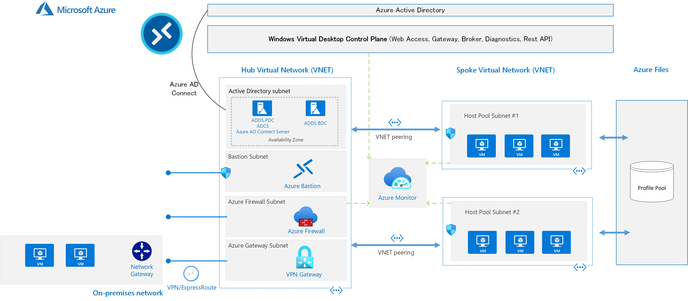
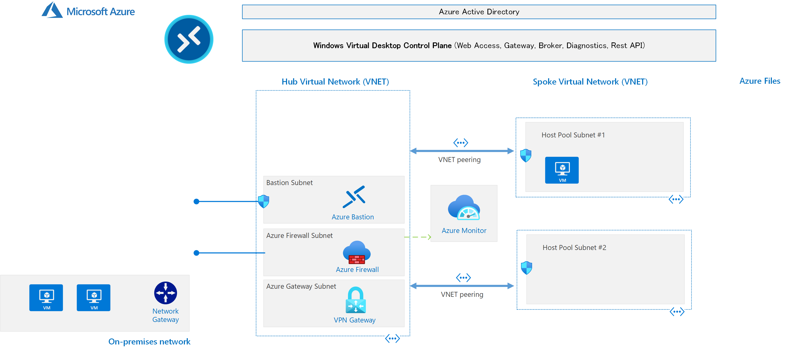
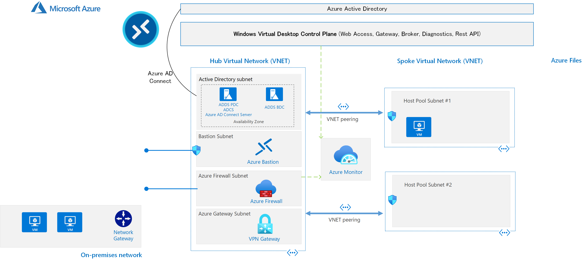
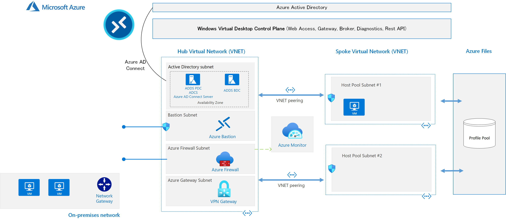

# Windows Virtual Desktop Reference Architecture

本番を想定したWindows Virtual Desktopのリファレンスアーキテクチャ

Preview機能などを積極的に取り入れているため、実際の本番環境で使うには十分注意が必要です。WVD環境を自社で構築、運用していたり、SIでWVD環境構築を担い今後のアーキテクチャ参考を求めている方に向けて公開しています。

このアーキテクチャでは、Azureにまつわるインフラ部分のみをカバーしています。Windowsのイメージ管理や各種の制御は含まれれていません。また、Azure Monitorによる監視は含まれていますが、バックアップも必要に応じて検討する必要があります。

ここで紹介するアーキテクチャは一例にすぎませんが、典型的なアーキテクチャであり、考慮するべきポイントを実例をもとにとらえることができます。

WVDをある程度知っている方向けです。初心者向けではありません。
初心者の方には
- [サクッと検証用Windows Virtual Desktopを構築](https://qiita.com/takeokams/items/ef26b60306d1cb5eee27)
- [Windows Virtual Desktop (WVD) クイックスタート](https://qiita.com/takeokams/items/26732ec60690f432b50d)

をお勧めします。

# リファレンスアーキテクチャ (全体像)


## 特徴
- ネットワークはハブ & スポーク アーキテクチャ
- インターネットに直接VMを公開しない; 管理、緊急時にはBastionを利用
- インターネットアクセスはオンプレミスに引き込まず、Azure上でブレークアウトさせる; Azure Firewall Premiumを使って柔軟で詳細なアクセスコントロール
- 高可用性を考慮; Availability Zone、マネージドサービスを利用
- ログの集中管理; Azure Monitorブックで可視化

ここから、段階的に環境を構築します。

# リファレンスアーキテクチャ (ネットワークインフラ)


下記からデプロイすると、上記のシステムが作成されます。

[](https://portal.azure.com/#create/Microsoft.Template/uri/https%3a%2f%2fraw.githubusercontent.com%2ftakeokams%2fwvd-reference-architecture%2fmain%2fazuredeploy.json)

補足
- 次のAD作成を行う場合は、Availability Zoneが必須となるので、東日本リージョンなどにデプロイしてください。西日本リージョンは対応していません
- Azure Firewall Premiumには、TLS Inspectionのための自己署名証明書のセット、WVDで必要とされるルールやログ取得の設定がされますが、他のインターネット向けのアクセスは許可されません
- VPN Gatewayの作成はオプションです。ExpressRouteで接続する場合はfalseのままにして、オンプレミスと接続します
- VM数に1をセットすると、Windows 10 Pro 20H2を1台、Spoke Networkに作るので、テスト用に使えます。例えばAzure Firewallのルールやオンプレミス環境との疎通確認など

# リファレンスアーキテクチャ (Active Directory)


下記からデプロイすると、既存環境に対してActive Directoryのドメインコントローラがデプロイされます。

[](https://portal.azure.com/#create/Microsoft.Template/uri/https%3a%2f%2fraw.githubusercontent.com%2ftakeokams%2fwvd-reference-architecture%2fmain%2faddeploy.json)

補足
- ハブネットワークにデプロイします。通常、上でデフォルト値で作ったVNetに対してデプロイする場合は、ネットワークの値を変更する必要はありません
- Availability Zoneを前提としていますので、対応している東日本リージョンなどにデプロイしてください。上記で作成したVNetと同じリージョンである必要があります
- ドメイン名はAzure Active Directoryと同じものが望ましいですが、必須ではありません
- 2つのWindows Server VM、PDCとBDC、PDCに対してはAD Certificate ServicesのEnterprise Root CAがこのデプロイで構成されます
- オンプレミスでActive Directoryを運用していて、同じアイデンティティを使いたい場合は、オンプレミスとつなげる必要があるのでこのテンプレートは使わず独自に構成する必要があります
- マネージドサービスであるAzure Active Directory Domain Servicesを使うこともできますが、Active Directory Certificate Servicesがないため、Azure Firewall PremiumのTLS Inspectionで使う証明書は独自に手配する必要があり、また各仮想デスクトップイメージに対しても配布方法を考慮する必要があります

## 各種設定
### Azure Active Directoryと構築したActive Directoryの接続
ユーザーの追加/削除などは、Azure上ではなく、構築したActive Directoryで行います。そのユーザーがAzure上のリソース(VMなど)にアクセスするにはAzureのユーザー管理を行うActive Directory(つまりAzure Active Directory)に同期している必要があり、ここでその設定を行います。

PDCにはAzure AD Connectがインストールされています。Azure Active Directoryと今ここで作ったADDCを同期するため、管理者でログインし、デスクトップ上にあるAzure AD Connectのアイコンをダブルクリックしてウィザードに従い構成します。

### 名前解決(DNS)の設定
名前解決を統一して行うため、ネットワーク全体にわたってDNSの設定を行います。

1. ハブネットワークのVNet(Azure FirewallやActive Directoryを立てたところ): PDC,BDCのIPアドレスをカスタムDNSとしてセット
2. ファイアウォールポリシー: DNSプロキシを、PDC,BDCのIPアドレスで構成
3. スポークネットワークのVNet: Azure Firewall Premiumのプライベートアドレスをセット

### Azure Firewall Premium TLS Inspectionのための証明書設定
Azure Firewall PremiumのTLS Inspectionで使う証明書に、Active Directory Certificate Servicesで作成したEnterprise Root CAで署名した、Intermediate CAをセットします。
1. 既存のKey Vaultに、自分のアカウントに対してアクセス権限を付与
2. そのKey Vaultで、「統合されていないCAによって発行された証明書」を作成してCSRを出力
3. PDCのVM内に構成されているADCSのEnterprise Root CAで、そのCSRを署名
4. Key Vaultに証明書を取り込む
5. ファイアウォールポリシーのTLS Inspectionで証明書を付け替え

# リファレンスアーキテクチャ (プロファイルストレージ)


下記からデプロイすると、既存環境に対してAzure Filesのストレージアカウントが作成され、共有ボリュームが設定されます。

[](https://portal.azure.com/#create/Microsoft.Template/uri/https%3a%2f%2fraw.githubusercontent.com%2ftakeokams%2fwvd-reference-architecture%2fmain%2fazurefilesdeploy.json)

補足
- WVDではWindowsのプロファイルをFSLogixを使ってローミングできるようにしますが、そのプロファイル置き場としての共有ボリュームをAzure Files上に作成します
- ストレージアカウントの名前は、Azure全体の中でユニーク(他で使われていない)なものを指定する必要があります。ストレージアカウント作成のブレードを出して事前に確認しておくのがおすすめです
- パフォーマンス上の理由(認証が終わってからデスクトップ画面が開くまでの時間)から、同時利用が100人を超えるような環境の場合は、Azure FilesではなくAzure NetApp Filesを利用検討することを推奨します

## 各種設定

ストレージをActive Directoryの管理下に置き、各種権限設定を行います。

設定は、[Microsoft Cloud Workshopのガイド](https://github.com/takeokams/MCW-Implementing-Windows-Virtual-Desktop-in-the-enterprise/blob/main/Hands-on%20lab/HOL%20step-by-step%20-%20Implementing%20Windows%20Virtual%20Desktop%20in%20the%20enterprise.md#%E3%82%BF%E3%82%B9%E3%82%AF-3-%E3%82%B9%E3%83%88%E3%83%AC%E3%83%BC%E3%82%B8-%E3%82%A2%E3%82%AB%E3%82%A6%E3%83%B3%E3%83%88%E3%81%AE-ad-%E8%AA%8D%E8%A8%BC%E3%81%AE%E6%9C%89%E5%8A%B9%E5%8C%96)をベースに行います。下記はその手順です。

### 下準備
[AzFilesHybridモジュール](https://github.com/Azure-Samples/azure-files-samples/releases)のzipファイルを上で作成したADのPDC VM内などにダウンロードして展開

PowerShell ISEを管理者モードで起動し、以下の一連のPowerShellコードを実行していきます。なお、スクリプトには各種変数があり、実環境に応じて変更する必要があります。

#### モジュールのインストールとAzureの認証

```powershell
Set-ExecutionPolicy -ExecutionPolicy Unrestricted -Scope CurrentUser
# 展開したディレクトリに置き換える必要あり
cd C:\Users\ADAdmin\Documents\AzFilesHybrid
if ($PSVersionTable.PSEdition -eq 'Desktop' -and (Get-Module -Name AzureRM -ListAvailable)) {
Write-Warning -Message ('Az module not installed. Having both the AzureRM and ' +
  'Az modules installed at the same time is not supported.')
} else {
Install-Module -Name Az -AllowClobber -Scope CurrentUser
}
.\CopyToPSPath.ps1
Import-Module -Name AzFilesHybrid
Connect-AzAccount
#Azure Active Directoryの管理者アカウントで認証、Active Directory Domain Serviceではなく、Azureのアカウントであることに注意
```

#### 作成したストレージアカウントのActive Directoryへの登録
これでコンピュータオブジェクトがADに作成され、アクセスするための権限設定がADのユーザーに対してできるようになります
```powershell
# 実際のサブスクリプションIDに置き換える必要あり、Get-AzSubscription で確認可能
$SubscriptionId = "00000000-0000-0000-0000-000000000000"
# ストレージアカウントがあるリソースグループ名に置き換える必要あり
$ResourceGroupName = "wvd-rg"
# 作成したストレージアカウント名に置き換える必要あり
$StorageAccountName = "takeokast"
Select-AzSubscription -SubscriptionId $SubscriptionId
Join-AzStorageAccount -ResourceGroupName $ResourceGroupName
# ストレージアカウント名を尋ねられるので、ここで入力。このスクリプトの場合、"takeokast"
$storageaccount = Get-AzStorageAccount -ResourceGroupName $ResourceGroupName -Name $StorageAccountName
$storageAccount.AzureFilesIdentityBasedAuth.DirectoryServiceOptions
$storageAccount.AzureFilesIdentityBasedAuth.ActiveDirectoryProperties
```

#### 権限をまとめたセキュリティグループを作成
```powershell
# WVDを利用するユーザーをまとめたグループ (要件によって、設計する必要あり)
New-ADGroup -Name "WVD_Users" -GroupScope Global -GroupCategory Security -Description "Members of this group are WVD users"
#FSLogixに関するAzure Filesへの権限グループ
New-ADGroup -Name "AZF FSLogix Contributor" -GroupScope Global -GroupCategory Security -Description "Members of this group are FSLogix Contributor"
New-ADGroup -Name "AZF FSLogix Elevated Contributor" -GroupScope Global -GroupCategory Security -Description "Members of this group are FSLogix Elevated Contributor"
New-ADGroup -Name "AZF FSLogix Reader" -GroupScope Global -GroupCategory Security -Description "Members of this group are FSLogix Reader"
# WVDユーザーがFSLogixのプロファイルを置くAzure Filesへアクセスするための登録
Add-ADGroupMember -Identity "AZF FSLogix Contributor" -Members "WVD_Users"
# Azure AD Connectの同期を開始して、上記を即時反映
Start-ADSyncSyncCycle -PolicyType Delta
```

#### ストレージアカウントのAzure上(ADでない)でのアクセス制御(IAM)設定
```powershell
New-AzRoleAssignment -ObjectId (Get-AzADGroup -DisplayName "AZF FSLogix Contributor").Id -RoleDefinitionName "Storage File Data SMB Share Contributor" -ResourceName $StorageAccountName -ResourceGroupName $ResourceGroupName -ResourceType "Microsoft.Storage/storageAccounts"
New-AzRoleAssignment -ObjectId (Get-AzADGroup -DisplayName "AZF FSLogix Elevated Contributor").Id -RoleDefinitionName "Storage File Data SMB Share Elevated Contributor" -ResourceName $StorageAccountName -ResourceGroupName $ResourceGroupName -ResourceType "Microsoft.Storage/storageAccounts"
New-AzRoleAssignment -ObjectId (Get-AzADGroup -DisplayName "AZF FSLogix Reader").Id -RoleDefinitionName "Storage File Data SMB Share Reader" -ResourceName $StorageAccountName -ResourceGroupName $ResourceGroupName -ResourceType "Microsoft.Storage/storageAccounts"
```

#### ストレージアカウントにある共有ボリュームのマウント
````powershell
# 異なる名前で共有名を設定している場合は置き換える必要あり
$share_name = "wvdfileshare"
# Azure Portalで、ストレージアカウントのアクセスキーを確認し置き換える必要あり
# パスワードにはADのポリシーにより有効期限がある場合があり、https://docs.microsoft.com/ja-jp/azure/storage/files/storage-files-identity-ad-ds-update-passwordを事前に参照して運用を検討する必要あり
$st_key = "access_key"
# ローカルでマウントするドライブレター
$mount_drv = "Z"

$unc_path = "\\" + $StorageAccountName + ".file.core.windows.net\" + $share_name
$net_account = "Azure\" + $StorageAccountName

$securePass = ConvertTo-SecureString $st_key -AsPlainText -Force
$cred = New-Object System.Management.Automation.PSCredential $net_account, $securePass

New-PSDrive -Name $mount_drv -PSProvider FileSystem -Root $unc_path -Credential $cred
````

#### フォルダーの作成と権限の設定
```powershell
$mount_point = $mount_drv + ":"

# 共有ボリュームの権限設定
$folder_path = $mount_point

$aclparam = @("AZF FSLogix Contributor", "ReadAndExecute", "ContainerInherit,ObjectInherit", "None", "Allow")
$rule = New-Object  System.Security.AccessControl.FileSystemAccessRule  $aclparam
$acl = Get-Acl $folder_path
$acl.AddAccessRule($rule)
Set-Acl $folder_path -AclObject $acl

$aclparam = @("AZF FSLogix Elevated Contributor", "ReadAndExecute", "ContainerInherit,ObjectInherit", "None", "Allow")
$rule = New-Object  System.Security.AccessControl.FileSystemAccessRule  $aclparam
$acl = Get-Acl $folder_path
$acl.AddAccessRule($rule)
Set-Acl $folder_path -AclObject $acl

$aclparam = @("AZF FSLogix Reader", "ReadAndExecute", "ContainerInherit,ObjectInherit", "None", "Allow")
$rule = New-Object  System.Security.AccessControl.FileSystemAccessRule  $aclparam
$acl = Get-Acl $folder_path
$acl.AddAccessRule($rule)
Set-Acl $folder_path -AclObject $acl

# Profiles フォルダ
$folder_path = $mount_point + '\' + 'Profiles'
mkdir $folder_path

$aclparam = @("CREATOR OWNER", "FullControl", "ContainerInherit,ObjectInherit", "None", "Allow")
$rule = New-Object  System.Security.AccessControl.FileSystemAccessRule  $aclparam
$acl = Get-Acl $folder_path
$acl.SetAccessRuleProtection($true,$false) #継承削除
$acl.SetAccessRule($rule)
Set-Acl $folder_path -AclObject $acl

$aclparam = @("AZF FSLogix Elevated Contributor", "FullControl", "ContainerInherit,ObjectInherit", "NoPropagateInherit", "Allow")
$rule = New-Object  System.Security.AccessControl.FileSystemAccessRule  $aclparam
$acl = Get-Acl $folder_path
$acl.AddAccessRule($rule)
Set-Acl $folder_path -AclObject $acl

$aclparam = @("AZF FSLogix Contributor", "AppendData,ReadAndExecute,Synchronize", "ContainerInherit,ObjectInherit", "NoPropagateInherit", "Allow")
$rule = New-Object  System.Security.AccessControl.FileSystemAccessRule  $aclparam
$acl = Get-Acl $folder_path
$acl.AddAccessRule($rule)
Set-Acl $folder_path -AclObject $acl

# ODFC フォルダ
$folder_path = $mount_point + '\' + 'ODFC'
mkdir $folder_path

$aclparam = @("CREATOR OWNER", "FullControl", "ContainerInherit,ObjectInherit", "None", "Allow")
$rule = New-Object  System.Security.AccessControl.FileSystemAccessRule  $aclparam
$acl = Get-Acl $folder_path
$acl.SetAccessRuleProtection($true,$false) #継承削除
$acl.SetAccessRule($rule)
Set-Acl $folder_path -AclObject $acl

$aclparam = @("AZF FSLogix Elevated Contributor", "FullControl", "ContainerInherit,ObjectInherit", "NoPropagateInherit", "Allow")
$rule = New-Object  System.Security.AccessControl.FileSystemAccessRule  $aclparam
$acl = Get-Acl $folder_path
$acl.AddAccessRule($rule)
Set-Acl $folder_path -AclObject $acl

$aclparam = @("AZF FSLogix Contributor", "AppendData,ReadAndExecute,Synchronize", "ContainerInherit,ObjectInherit", "NoPropagateInherit", "Allow")
$rule = New-Object  System.Security.AccessControl.FileSystemAccessRule  $aclparam
$acl = Get-Acl $folder_path
$acl.AddAccessRule($rule)
Set-Acl $folder_path -AclObject $acl

# MSIX フォルダ
$folder_path = $mount_point + '\' +'MSIX'
mkdir $folder_path

$aclparam = @("AZF FSLogix Elevated Contributor", "FullControl", "ContainerInherit,ObjectInherit", "NoPropagateInherit", "Allow")
$rule = New-Object  System.Security.AccessControl.FileSystemAccessRule  $aclparam
$acl = Get-Acl $folder_path
$acl.SetAccessRuleProtection($true,$false) #継承削除
$acl.AddAccessRule($rule)
Set-Acl $folder_path -AclObject $acl

$aclparam = @("AZF FSLogix Contributor", "ReadAndExecute,Synchronize", "ContainerInherit,ObjectInherit", "NoPropagateInherit", "Allow")
$rule = New-Object  System.Security.AccessControl.FileSystemAccessRule  $aclparam
$acl = Get-Acl $folder_path
$acl.AddAccessRule($rule)
Set-Acl $folder_path -AclObject $acl
```

#### 共有ボリュームのアンマウント
````powershell
Remove-PSDrive -Name $mount_drv
````

#### ストレージアカウントへのハブネットワークからのアクセス設定
ストレージアカウント -> ネットワーク -> 許可するアクセス元で選択されたネットワークから、ハブネットワークを指定します。これにより、共有ボリュームへのSMBアクセスはファイアウォールにルートされずダイレクトにつながるため、ファイアウォールのルールを設定する必要なく、またこのハブ以外からのアクセスを拒否できます

## 利用の仕方
### FSLogix VHDパス
`\\<storage_account>.file.core.windows.net\wvdfileshare\Profiles`

のようにプロファイルの場所を指定できます。
### アクセス権限
ユーザーがプロファイルを置くためには`AZF FSLogix Contributor`グループに属している必要があります。上記で作ったセキュリティグループでは、`WVD_Users`にユーザー登録するのがよいでしょう。このユーザーを、WVDのアプリケーショングループに許可することで、簡単に権限管理をすることができます。

# ここから
これで、WVDをデプロイする環境が整いました。

ホストプール等関連リソースを作成し、ログ関連の設定をして、グループポリシーかイメージファイルの中でFSLogix VHDの場所をし、利用者を割り当てれば、WVDとして最低限の利用環境が整います。

さらに、日本語イメージの準備、ファイアウォール許可ルールの設定、各種利用ポリシーの設定、電源管理などを行う必要があるでしょう。


# 参考
- [Azure Reference: Hub-spoke network topology in Azure](https://docs.microsoft.com/en-us/azure/architecture/reference-architectures/hybrid-networking/hub-spoke)

- [Quick Start Template: Create a new AD Domain with 2 DCs using Availability Zones](https://azure.microsoft.com/ja-jp/resources/templates/active-directory-new-domain-ha-2-dc-zones/)

- [Windows Virtual Desktopで使う日本語UIのWindows 10 + Officeのマスターイメージを作る](https://qiita.com/takeokams/items/4e0753047822b13bbcf7)

- [WVDの監視機能であるAzure Monitorを使ってみる](https://qiita.com/takeokams/items/8cfb1dba57f7afe9653c)

- [サクッと検証用Azure Firewall Premiumを構築](https://qiita.com/takeokams/items/67c7cb5374e865dd27b6)

- [Azure AD Connect の接続削除方法](https://qiita.com/takeokams/items/a47f52aa2fd28f950a48)
